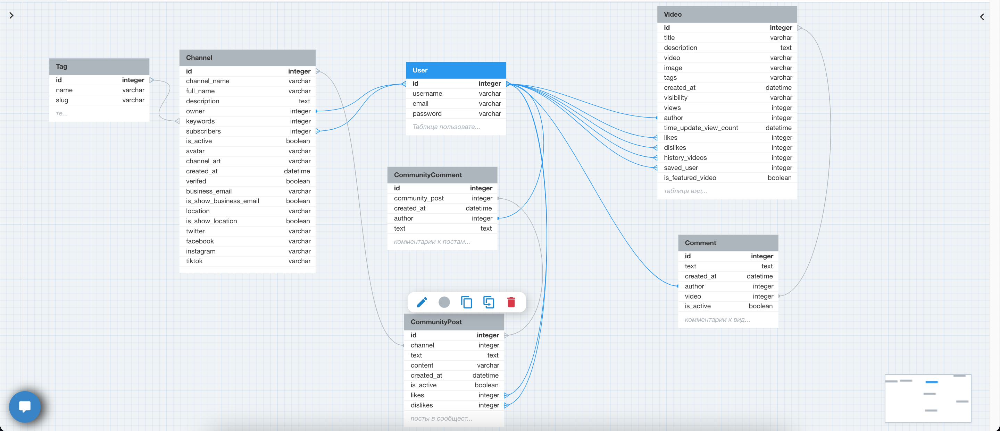

# Youtube Clone

## Реализованный функционал:
- Аутентификация/авторизация (по email)
- Просмотр популярных видео/поиска по видео/поиск по тегам видео
- Лайки/дизлайки видео, также лайки/дизлайки постов в сообществе канала
- Добавление видео на канала/добавление постов в сообщество канала(с изображенрями)
- Добавление/удаление комментариев к видео и постам сообщества
- Система подписок на канал

Развернуть локально:
1. git clone https://github.com/romaha57/youtube_killer.git
2. cd youtube
3. docker build -t youtube_killer .
4. docker run -it -p 8000:8000 youtube_killer

Вход в админ-панель:

> Email: admin@mail.ru

> Пароль: 123

P.s. Файл БД sqlite3 добавлен в репозиторий для тестовых данных

Схема БД:

